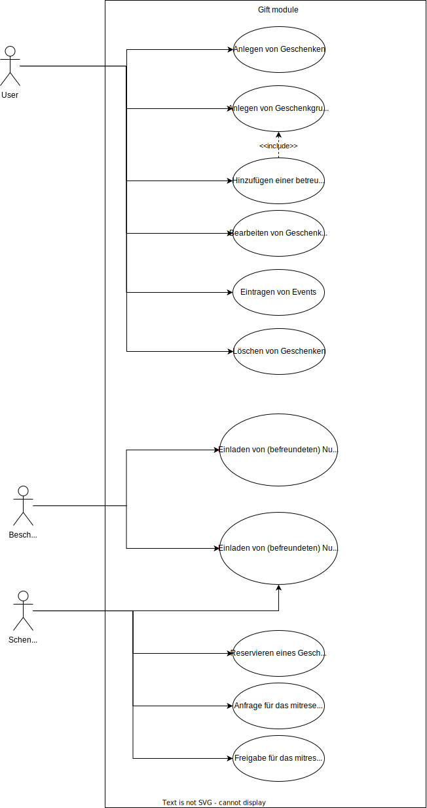
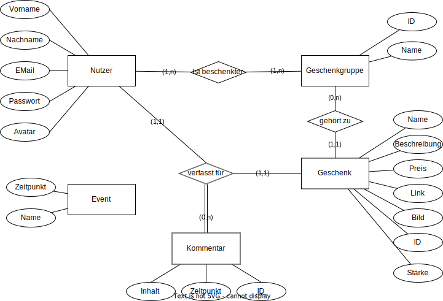

# My DrawIO Diagrams
## Use Cases

## ER-Model   
 
## Datenbank Schema
### Nutzer
- <u>Email:Varchar</u>
- Vorname:Varchar
- Nachname:Varchar
- Passwort:Varchar
- Avatar:Blob

### Geschenkgruppe
- <u>ID:Integer</u>
- Name:Varchar
- Bearbeitbar:Boolean

### IstBeschenkter
- <u>EMail:Varchar</u> [Email -> Nuter.Email]
- <u>ID:Integer</u> [ID -> Geschenkgruppe.ID]

### Geschenk
- <u>Name: Varchar</u>
- <u>ID:Integer</u> [ID->Geschenkgruppe.ID]
- Beschreibung:Text
- Preis:float
- Link:VARCHAR(2083)
- Bild: Blob
- Stärke: ENUM
- Email:Varchar [Email->Nutzer.Email]

### Kommentar
- <u>ID:Integer</u>
- Inhalt:Text
- Zeitpunkt:Timestamp
- Email:Varchar [Email->Nutzer.Email]
- Name:Varchar [Name -> Geschenk.Name]

### Event
- <u>Name:Varchar</u>
- Zeitpunkt:Timestamp