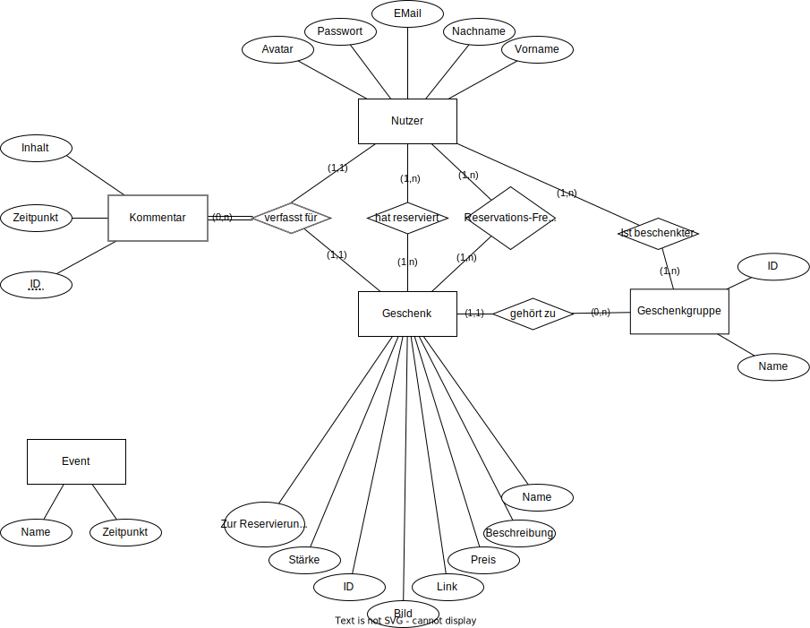

# My DrawIO Diagrams
## Use Cases

## ER-Model   
 
## Datenbank Schema
### Nutzer
- __Email:Varchar__
- Vorname:Varchar
- Nachname:Varchar
- Passwort:Varchar
- Avatar:Blob

### Geschenkgruppe
- __ID:Integer__
- Name:Varchar
- Bearbeitbar:Boolean

### IstBeschenkter
- __EMail:Varchar__ [Email -> Nuter.Email]
- __ID:Integer__ [ID -> Geschenkgruppe.ID]

### Geschenk
- __Name: Varchar__
- __ID:Integer__ [ID->Geschenkgruppe.ID]
- Beschreibung:Text
- Preis:float
- Link:VARCHAR(2083)
- Bild: Blob
- Stärke: ENUM
- Email:Varchar [Email->Nutzer.Email]

### Kommentar
- __ID:Integer__
- Inhalt:Text
- Zeitpunkt:Timestamp
- Email:Varchar [Email->Nutzer.Email]
- Name:Varchar [Name -> Geschenk.Name]

### Event
- __Name:Varchar__
- Zeitpunkt:Timestamp